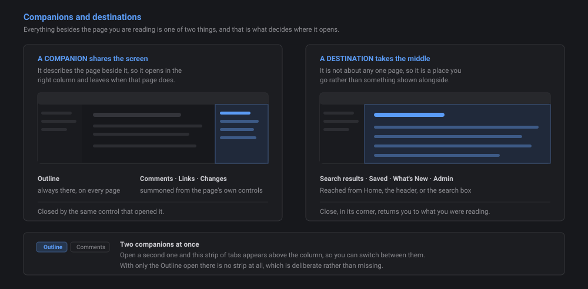

# Folio Help

> [!NOTE] About this page
> This page lives with the app, not inside your vault, so it never appears in the navigation tree. Press the **?** icon in the header to come back here at any time. Written for **Version 0.68.0**.

**This page covers using Folio** — finding your way around, reading, searching, saving, and making it look the way you want.

**Writing and editing notes is a separate page: [Help — Editing and Markdown](help-edit.md).** Go there for turning on editing, creating and moving files, the editor, properties, review, and the full Markdown reference.

New here? Read [[#1. Start here]] and [[#2. Getting around]], then stop. That is enough to use Folio.

---

## Contents

1. [[#1. Start here]] — what this is, installing it, your first launch
2. [[#2. Getting around]] — the header, companions and destinations, Vault Files, moving between notes
3. [[#3. Reading a note]] — folding, sending someone a link, images, tables, checkboxes
4. [[#4. Finding things]] — What's New, Outline, Search, Saved, Links
5. [[#5. Making it yours]] — the Theme panel and Settings
6. [[#6. Comments]] — leaving and answering comments
7. [[#7. Quick reference]] — shortcuts and where every control lives
8. [[#8. Troubleshooting]] — when something is not working

---

## 1. Start here

### What Folio is

Folio reads a folder of Markdown notes and presents it as one shared reference for the team. It is a reader first: you can browse, search and comment without ever changing a file. Editing is off until you turn it on.

The notes are ordinary `.md` files in a OneDrive-synced folder. Obsidian and Folio are two windows onto the same files — edit a note in Obsidian and it is there in Folio on the next load, and the reverse. Nothing is locked into this app.

### Installing it

Folio is a web app at a link, not a file to copy around. Installing it as an app rather than bookmarking the page matters: that is what lets your browser remember your vault folder permanently instead of asking every launch.

**One-time setup:**

1. Open the Folio link in **Chrome or Edge**. Safari does not support the folder access this needs.
2. Install it: click the **install icon in Folio's own header**, next to the dark/light toggle, and confirm. If that icon isn't there, use the browser's own route instead — address bar → the install icon (a small monitor with an arrow), or **⋯ menu → Apps → Install this site as an app**.
3. Click **Open vault folder…** and pick your local OneDrive-synced copy of the vault. Pick the folder that *directly* contains your notes and note folders, not a parent of it.
4. When the browser asks **Allow this time / Allow on every visit / Don't allow**, choose **Allow on every visit**. This is the step that stops it asking again.

**Daily use:** open it from wherever you installed it, Start menu, taskbar or desktop. It should load straight to your vault with no prompt. Folio's own install icon disappears once you're running the installed copy — if you still see it, you're in a browser tab, not the installed app.

**Teams tab:** your team lead can add Folio to a channel via **+ Add a tab → Website**, pasting the same link.

*On a brand new device, Folio walks steps 3–4 above, installing, and your first launch below as one connected sequence instead of three separate prompts. The steps themselves are unchanged, just presented together.*

### Your first launch

The first time you open Folio it asks for your **name and email**. This is not a login and there is no password. Folio inherits whatever access you already have to the folder. The name is what appears on comments you post; the email is the key your bookmarks and favorites are filed under. Folio saves that into the vault folder, so if your access to the folder is view-only it stops here and asks you to contact your system administrator. **Close Folio** is the only way out until access is given.

Your profile is stored in the vault itself, so typing the same email on a different PC brings your saved name and bookmarks back. You will see a "Recognized" note and one more click to confirm.

To change it later: **your initials badge, top right → Switch user**.

### The screen at a glance

Three parts. The **reader** in the middle is the note you're on, with a slim strip of controls above it: Back, Forward, Copy link, Save, Comments. **Vault Files**, on the left, holds the tree of notes and toggles from the header. On the right, **Outline** is always there, and pointing at a page's Comments or Links brings that companion in beside it too.

A few things aren't about any one page, the full Search results, **Saved**, and (if you have it) **Admin**, so they take over the middle instead of sharing it. All of this is covered in [[#2. Getting around]].

---

## 2. Getting around

### The header bar

| Control | What it does |
|---|---|
| Vault Files icon, far left | Show or hide Vault Files |
| **Home** | The front door. Doors into Continue reading, Browse, Saved, What's New, Help, and Admin if you have it |
| **Search, saved, recent…** | Opens quick search. Same box as `Ctrl K` / `⌘K` |
| **⭳** (only when not installed) | Installs Folio — see [[#Installing it]] |
| **☀ / ☾** | Flip Dark ↔ Light straight away, no menu |
| **↑** (only when an update is ready) | Click to reload into the newer version |
| **?** | This help page |
| Your initials | Account menu: Theme, Settings, Switch user, Usage, Sign out |

There is no gear icon in the header. Settings lives in the initials menu.

### The page controls

A slim strip sits above every note:

| Control | What it does |
|---|---|
| **←  →** | Back and Forward, same as a browser |
| *filename* | Where you are |
| Copy-link icon | Copies a link to this page |
| Save icon | Saves the whole page, see [[#Saved]] |
| Comments icon | Opens the Comments companion for this page. The number beside it counts open comments |
| **⋯ More** | Backlinks (as **Links**), Properties, and Edit if you have it |

Point at any heading and its own small row appears: copy a link to that section, save it, or comment on it. See [[#Sending someone a link]] and [[#6. Comments]].

### Vault Files

- **Show or hide it**: the icon at the far left of the header. Dragging the panel's inner edge changes its width but never closes it, so a stray drag cannot make the tree disappear.
- **Set its width**: drag the inner edge. Double-click that edge to fit the panel to the longest name in view. Your width is remembered on that computer.
- **The note you are reading** is marked in the tree with a bar down its edge, a tint behind the row, or both.
- **Expand a folder**: click the folder row. Files load the first time you open it and stay cached until you reload.
- **Fold control**: one button to the right of the "Vault Files" label. It collapses the whole tree, and the same button expands it again once everything is closed.
- **New and Move** sit at the bottom of Vault Files, and only appear at Contributor or above. Pointing at a folder row also reveals a **+** that creates a file inside that folder, where the one at the bottom creates at the vault root.
- **The tree remembers how you left it.** Folders you open stay open across reloads and between sessions, on your own machine.
- **Sort order**: folders with a numeric prefix (`00_Identity`, `01_Projects`) sort numerically. Unprefixed folders sort alphabetically after them.
- **File counts**: the badge on each folder is how many `.md` files it holds. Turn it off in Settings.
- **Trim number prefixes**: hides a two-digit prefix from folder AND file names on screen without touching anything on disk. `00_Home` reads as `Home`. On by default; Settings.
  - The rule is deliberately narrow: **exactly two digits, then one `_` or `-`**. A file called `2024-Q1 Review` keeps its name in full.
  - Links work either way. `[[05-Safety Plan]]` and `[[Safety Plan]]` both find the same note.

**What the tree never shows:** anything ending `.comments.md` or `.changes.md`, anything starting with `.`, the `zSystem` folder, your Obsidian attachments subfolder, the `/config/`, `/themes/` and `/assets/` folders, and this help page.

### Companions and destinations

Everything besides the page you're reading is one of two things.

A **companion** describes the page beside it, so it shares the screen with it: **Outline** is always there, and opening a page's Comments or Links brings that companion in next to it too. Open more than one and a small strip of tabs appears above the column so you can switch between them, the same control that opened a companion closes it again.

A **destination**, the full Search results, **Saved**, and **Admin**, isn't about any one page, so it takes over the middle of the screen instead. **Close**, in its corner, takes you back to whatever you were reading, or to Home if that's where you came from.

### The guided tour

The first time anyone opens Folio on a device, it walks through the screen: Home, search, Vault Files, where Comments lives, a handful of highlighted stops with a line of text each. It runs once, automatically. To see it again, use **Settings → Walkthrough → Run again**.

### Moving between notes

**Back** and **Forward**, top left above the page, work like a browser's and restore your scroll position, not just the file. The history is session-only and resets when you reload.

**Continue reading** on Home reopens the note you were last reading, expanding whatever folders are needed to reach it.

---

## 3. Reading a note

### Who owns this page

Under the title, a line names the page's **owner** and, if a review date is set, when it's due. A green check means it's on schedule, amber means it's coming due soon, and red means it's overdue. No line at all just means nobody has set an owner or a due date on this page yet — not every page needs one.

### Where you are

A thin bar under the header tracks the heading you're currently reading, so a long page never leaves you unsure where you are without scrolling back up to check.

### Folding headings

Every heading H1 through H6 folds. Click the **chevron** to the left of a heading to fold or unfold its section; child headings fold with their parent. **Alt-click** the chevron (Option on a Mac) to fold or unfold the entire subtree beneath it in one go.

**A note always opens fully expanded.** Nothing you fold is remembered between visits. This is deliberate: folds used to be saved per note, which meant a note could open collapsed weeks later because of a Collapse All somebody ran once, with nothing on screen to say anything was missing.

When something *is* folded, the row says so — a small **"N hidden"** badge appears next to it, counting the headings and list items tucked underneath. You should never have to wonder whether a note is short or just closed.

**Clicking the heading text**, rather than the chevron, selects that heading: the row highlights and the Outline moves its marker to match, holding there until you scroll.

**Collapse all and Expand all are in the Outline panel**, not the reader — see [[#Outline]] below. The reader folds one heading at a time.

### Sending someone a link

Every page has an address, and so does every heading on it.

**Copy link**, in the row of controls above the reader (see [[#The page controls]]), copies the address of the page you are reading, ready to paste into Teams or an email. Anyone who opens it lands on that page.

**To link to one section rather than the whole page**, point at its heading. A small row of controls appears on the right: the first copies a link straight to that heading, so the person you send it to arrives at the right part of a long note instead of the top. The same control appears on Outline rows when you point at them, which is handier when the section you want is not the one you are looking at.

The second control **saves that section** to Saved, the same save you can add from the Outline. See [[#Saved]].

The third opens **Comment on this section**, the same composer as the Comments companion, with this heading already locked in as the target. See [[#6. Comments]].

The last, Highlight, stays greyed out: highlighting is private to whoever adds it and doesn't have anywhere to live yet, so it's shown only so you can see what's coming.

**If somebody renames a heading, links to it stop working** and open the page at the top instead. That is worth knowing before you paste a section link into something permanent. A link to the page itself keeps working as long as the file is not renamed.

**Back and Forward** work like a browser's. Both do the same thing a browser's own buttons would.

### Folding lists

Nested lists get their own chevrons. Click one to fold that item's children, or **Alt-click** to fold its whole subtree at any depth — the same modifier as headings.

**Hover anywhere over a list** and a small **All** control appears at the end of its first row, folding or unfolding that entire list. It does nothing Alt-click cannot; it is there so you can find it. Lists with no nesting have nothing to collapse and get no control.

Unlike headings, **list folds are remembered per note.** The asymmetry is on purpose: headings are scaffolding you did not write, lists are content the author shaped, and a long checklist you collapsed is usually meant to stay collapsed. The "N hidden" badge is what makes that safe — a bullet that reopens reading "12 hidden" tells you exactly what it is holding.

If you would rather every note opened fully expanded, turn off **Remember collapsed lists** (Settings → Navigation, on by default). Folds then last only while you are on the page. Turning it off also clears the folds already saved, rather than leaving them to spring back if you switch it on again later — a fold you set weeks ago and cannot remember setting is exactly what this app tries not to do to you.

### Folding callouts

Every callout with a body has a **chevron** at the right of its coloured title row. Click it to fold the body away. The title row keeps its colour, icon and title, so a folded warning still reads as a warning.

If you write callouts in Obsidian, its `-` and `+` suffixes work here: `> [!warning]-` opens collapsed, `> [!warning]+` opens expanded. Unlike Obsidian, you do not *need* a suffix — every callout folds here regardless. Nothing is written back to the file and nothing is remembered; the file decides how a callout opens, every time.

### Links between notes

| You write | It does |
|---|---|
| `[[Note Name]]` | Opens that note |
| `[[Note Name\|Display text]]` | Same, with your own wording |
| `[[Note Name#Heading]]` | Opens that note and scrolls to the heading |
| `[[#Heading]]` | Scrolls within the note you are already reading |
| `[text](https://example.com)` | Opens in a new tab |

Links resolve against every file loaded so far. A link to a note in a folder you have not expanded yet shows **muted and dashed** — expand that folder and it lights up. Jumping to a heading unfolds whatever was hiding it and gives it a brief highlight so you can see where you landed.

Writing links is covered in [Help — Editing and Markdown](help-edit.md).

### Folder and file-share links

A link to a network folder or drive path (`file://` UNC, or `X:\\...`) cannot open Explorer from a web page. No browser allows it. Clicking one **copies the cleaned path to your clipboard** instead, with a brief confirmation, ready to paste into Explorer's address bar.

### Images

Each note's images live in a subfolder next to it, named "Attachments" by default here, following Obsidian's **"in subfolder under current folder"** setting. That subfolder is hidden from the tree automatically.

### Tables, and widening a column

Tables render as written. Obsidian sizes each column to its widest cell, so the usual way to force a narrow column wider there is to add a row of periods under the header.

**Column alignment follows Obsidian's own syntax.** Put a colon on either side of the dashes in the header's separator row — `:--` for left, `:--:` for center, `--:` for right — and a plain `--` stays left-aligned. Nothing to turn on; it's read straight from the table.

A table's header row stays visible while you scroll through a long one, and lets go on its own once you've scrolled past the last row.

Folio understands that row. **A row made entirely of periods is hidden in the reader, but still sets the column widths** — you get the layout you set up in Obsidian without the dots showing. A cell needs **five or more periods and nothing else** to count as padding.

If any cell in the row has real text in it, the whole row is treated as content and shows normally. So a cell reading `Waiting.....` is safe.

### Tags

`#tag` renders as a coloured chip, `#parent/child` for a nested one. Tags follow your accent colour. They are display-only for now, no click-to-filter.

### Ticking task checkboxes

`- [ ]` and `- [x]` items are clickable straight from the reader, with no need to open the editor. This needs editing turned on. Ticking a box writes to the file quietly: no change-log entry, no "Needs Review" flag.

---

## 4. Finding things

*How to open and close a companion or a destination (Outline, Comments, Links, Search, Saved, Admin) is covered in [[#Companions and destinations]]. This section is about what each one shows.*

### What's New

The row above the vault tree, with a count of pages you have not seen yet. Click it for a page listing everything that has changed, newest first. The count disappears when you are up to date rather than sitting at zero.

- **New vs Updated** — New means the page did not exist last time Folio looked. Updated means it did and its contents have changed since. New is worked out from the list of pages rather than from dates, so a page still reads as New even after its properties get filled in. Updated is worked out by comparing the page's actual text, so OneDrive touching a file without changing anything in it does not count as an edit.
- **An updated page lists the sections that changed.** The headings appear under the file name. Click one and the page opens at that heading with it highlighted, the same as clicking an Outline entry. The highlight stays until you scroll. If several separate edits land before you get to the page, all of them are listed.
- **Clicking a heading clears that heading only.** The others stay waiting. The file itself is not marked seen until the last one is done, so the count still tells you there is reading left. Opening the file name instead of a heading answers all of them at once, because you opened the page.
- **A heading you have already read stays in the list**, greyed out, and stays clickable. That is how you get back to it if you clicked the wrong one. If it gets edited again later it goes back to unread, because clearing it answered the edit you read, not every edit it will ever get.
- **A page with no sections listed** was changed somewhere outside a heading, or only in its properties.
- **The date on the right is colour-coded by age** — green within the last week, amber up to a month, grey after that. It is only ever a second way of saying what the date and the group heading already say, so nothing is hidden if the colours are hard for you to tell apart.
- **Seen happens when you leave a page, not when you open it.** Open something from the list, read it, come back, and it is marked seen. That way the highlight is still there when you return, instead of clearing the instant you click.
- **The first time you ever open Folio, everything counts as seen.** You start from today rather than from a list of every page anyone has ever written.
- **Filters** — Unseen, New, Updated or All, and a separate 30 days / 90 days / All time window. Both are remembered, and every one of them shows the changed headings under a file, not just Unseen.
- **Mark all seen** clears the list, and **skips anything marked as required reading**, telling you what it skipped. Required pages can only be cleared by actually opening them.
- **Renaming or moving a page in Obsidian does not resurface it** for the whole team — it is matched by its contents, so it keeps whatever seen state it already had. Deleting one removes it from the list.
- **If hundreds of pages change at once** — usually OneDrive rewriting timestamps rather than anyone editing — the list says so in one line instead of flooding.

**Marking a must read.** There is no separate button: **opening the page is what clears it** from your Required reading group. Mark all seen deliberately skips required pages, so the only way one comes off your list is that you read it. If a staff update email pointed you here, that is the whole answer — click the page, read it, done.

**Required reading and onboarding.** Two optional properties an author can put on a note:

| Property | What it does |
|---|---|
| `must-read: true` | Puts the page in a **Required reading** group with an orange pill, and keeps it out of Mark all seen. Fades from required after 30 days, counted from the first time *you* saw it, so time off doesn't cost you the notice. It stays in your list as unseen until you open it. |
| `onboarding: true` | Marks the page as one a new starter should read. Never expires. |

Set them the same way as any other property, in the Properties panel or in Obsidian. See [Help — Editing and Markdown](help-edit.md).

**Where this is stored:** on your own machine, like your theme and your open folders. Nothing about what you have read is written into the vault, and nobody else can see it.

### Outline

Every heading H1 through H6 in the current note, indented by level. Click one to scroll to it; the active heading highlights as you scroll.

The badge next to the label counts the headings in the note, the same way the badge on a folder row counts its files.

Each outline row with headings under it has its own chevron; **Alt-click** one to take its whole subtree. The **single button** on the right of the toolbar collapses the whole outline, and the same button expands it again once everything is folded.

**The Outline and the reader fold independently.** Collapsing the outline gives you a quick map of a long note without collapsing the note you are reading, and folding a heading in the reader leaves the outline intact. This is how Word's Navigation Pane, Obsidian's Outline and VS Code's Outline view all behave — an outline is a view of the document, so folding it is a view operation.

Neither the outline's folds nor the reader's survive a reload.

### Search

Press **⌘K** (Mac) or **Ctrl+K** (Windows), or click **Search, saved, recent…** in the header, to open quick search.

Empty, it shows your saved pages and what you've opened recently. Start typing and it searches the whole vault, pages whose name matches first, then pages that match in their text.

**Results group under the page they came from.** The page name is the heading, with the folder beside it and a count of how many lines matched; the lines themselves are listed under it against a coloured rule, up to three per page, with your search term marked in each. Click the page name to open the page, or click a line to open it and land on that line. **See all results** at the bottom opens the full Search destination with everything the quick list left out.

**Esc** closes it. Arrow keys move through results, Enter opens the highlighted one.

The index is built once per session and refreshed whenever a file is written, so it will not go stale mid-session.

### Saved

**To save a whole page:** the **Save** icon above the reader, see [[#The page controls]].

**To save one section:** point at its heading and click the save icon in the row that appears, see [[#Sending someone a link]]. It saves that heading, not a copy of the text.

Either way, click the same control again to remove it.

**Reaching what you've saved:** Home's Saved door, the top of quick search when the box is empty, or **See everything saved** at the bottom of that same list. Either opens the full Saved destination.

The Saved destination groups everything by page. A page you saved whole sits under **Pinned**, at the top; a page where you've only saved a section or two sits below, under its own name, with those sections listed underneath it. Clicking a page opens it; clicking a saved section opens the page, scrolls to it and unfolds it.

**Saved pages that moved.** Every scan compares the vault against what it saw last time, so renaming or moving a page carries your saves across to it automatically. The one thing it can't follow is a page renamed **and** edited before Folio next opens: with both the name and the contents changed at once, there is nothing left to match on. A broken save shows a repair prompt rather than quietly failing.

Saved is **yours**, stored against your email in the vault, so it follows you to another PC rather than living in one browser.

Comments and change logs are a separate matter: those are files of their own, named after the page, and a rename does leave them behind. Renaming a page that has comments on it is worth avoiding for now.

### Links

Open it from **⋯ More → Links**, above the reader.

Two lists for the open note:

- **Outgoing** — everything this note links to, bucketed into MD Files, Websites, Folders and Other. Read live from the note, always complete.
- **Backlinks** — notes that link *to* this one. Only files opened this session are scanned, so this list grows as you browse. It is not a vault-wide index and is not meant to be one.

### Usage

**Administrator only.** A report on the vault, in three lists:

- **Most read** — which pages the team actually opens. Usually not the pages you expected when you built the vault.
- **Never opened** — pages nobody has ever read. The most useful list here: either the page is dead and can go, or it is needed and nobody can find it.
- **Gone quiet** — a page that used to get traffic and stopped for a month or more. Nearly always a page that went out of date and people gave up on.

Each list shows the top five with a **Show more** for up to twenty-five. Click any row to open that page.

**Who read it.** Each Most read row carries a reader count — *3 readers* — and clicking it opens a breakdown naming each person and how many times they opened that page. It is collapsed until you ask for it, and it is the answer to "is anyone but me actually using this" when someone asks a question the vault already answers.

Only Most read has this. **Never opened** has nobody to name, and **Gone quiet** is deliberately left anonymous: that list exists to prompt "has this page gone out of date", and turning it into a list of who stopped reading answers a different and less useful question.

**What is recorded, and when.** Folio notes which page you are on once it has loaded, and how long you stayed. Nothing is written while you read. When you switch away from the tab or close it, that sitting is written to a hidden file in the vault under `zSystem/Analytics/`, one file per person per month, one line per page per day. That file is safe to delete at any time; it will simply start again.

**Recording happens for everyone; reading the report does not.** The Usage tool is Administrator only — open it from your initials badge → Usage, which opens the Usage tab in Admin. But the log files themselves are ordinary Markdown in the vault, named after the person they belong to, so anyone who can open the vault in Obsidian can open them. **Nothing here is secret from the team, and it is not meant to be.** If that matters to you, the honest place to raise it is the folder, not the report.

Because the write happens when you leave, your own reading appears quickly and other people's lags by up to one sitting, plus however long OneDrive takes to sync. It is near-live, not live.

---

## 5. Making it yours

Two separate places. **Theme** is how Folio looks; **Settings** is how it behaves. Both live under your initials badge, top right.

### Theme panel

Open with **initials badge → Theme**. It is a popup, not a modal, so the note stays visible behind it and every change lands live as you make it. There is no Save button — everything writes the moment you change it. Each section has its own **Reset**, and there is a **Reset all** in the footer. One section opens at a time.

**This panel is shorter on purpose.** It offers five controls: Mode, Preset (Things or Minimal), Reading width, Text size, and Line spacing, described under Appearance and Reading below. Accent, body font, and the whole of Headings, Navigation icons, Interface and Share aren't shown here; your existing choices in those aren't changed, there's just no way to change them further from this panel. Switch to the old layout (**Settings → New look**, off) to reach the full panel described below. **Show page title**, previously part of Headings, lives at **Settings → New look** instead.

#### Appearance

| Control | Options | Default |
|---|---|---|
| Mode | Dark / Light / System | Dark |
| Preset | Default, Ocean, Frost, Clay, Mica, Marble, Things, Minimal | Things |
| Accent | The preset's own accent plus six alternates, tuned per mode | The preset's own |

A preset sets backgrounds, all six heading colours and the accent together, with separate dark and light definitions. **System** follows your computer's own dark/light setting. The accent drives buttons, links, the active row and tag chips.

#### Reading

| Control | Options | Default |
|---|---|---|
| Width | Narrow / Normal / Wide | Normal |
| Text size | Small / Medium / Large | Medium |
| Line spacing | Tight / Normal / Relaxed | Normal |
| Body font | System sans / Serif / Monospace | System sans |

#### Headings

- A **colour** for each level H1 through H6, plus an **underline** and a **capitals** toggle per level. Underline ships on for H2 only, capitals on for H5 only, which is how it looked before these controls existed.
- **Heading scale** — Compact / Normal / Large. One control instead of six size fields.
- **Inline title** — off by default. Turns on a large heading of the note's own name at the top of the document, Obsidian-style. The reader header shows the filename either way.

Changing any heading colour flips the badge to **Custom** and seeds all six from your current preset. Custom colours are held separately for dark and light, since a colour that reads on near-black often fails on white; there is a one-click **Copy these to the other mode** for when you want them to match. Picking a named preset again clears the override.

#### Navigation icons

| Control | Options | Default |
|---|---|---|
| Icon style | Folder and file / Chevron / Dot / None | Folder and file |
| Folder colour | Rainbow by position / Accent / Single colour / Muted | Rainbow by position |
| Colour file icons too | On / Off | Off |

Rainbow by position means folders cycle through a colour set based on where they sit in the tree. Choosing **Single colour** reveals a six-swatch picker holding the same hues the rainbow cycles through. File icons stay quiet next to coloured folders unless you turn the third control on.

#### Interface

| Control | What it does |
|---|---|
| Chrome tone | **Contrast** gives the panels, header and reader their own shades. **Match reader** flattens the panels and header into the reader surface. **Flat** puts everything on one surface. Default Contrast. |
| Borders | None, **Hairline** (default) or Strong. |
| Active row | How the open file is marked: a **Bar** on the edge, a **Tint** behind the row, or **Both** (default). |
| Density | **Compact**, Normal (default) or Roomy row spacing in Vault Files and Outline. |

> [!NOTE] Borders → None
> This clears the decorative dividing lines only. Toggle tracks, resize handles and input outlines keep their outline on purpose — without it they vanish rather than look minimal.

#### Share

Set your look up once and pass it to the rest of the team.

**Copy** puts your theme into the box as a `WBTHEME1:` string. Send it to someone; they paste it into the same box and click **Apply pasted**.

**Set as vault default** saves it to the vault itself, at `zSystem/theme.json`. Anyone opening Folio for the first time starts with that look instead of the plain default. It never overwrites a theme someone has already chosen — if you have used Folio before, your own settings stay exactly as they are.

Dark vs light is **not** included in a shared theme. That stays personal, and it can be set to System, so sharing a look never forces anyone else's screen to your preference.

#### Elsewhere

**Callouts** — all 13 Obsidian callout types render in theme-matched colours, grouped the way Obsidian groups them: note, info and todo share blue; failure, danger and bug share red, and so on. These follow the mode rather than the preset. There's also a 14th type Folio adds itself, `[!copy]`, which carries a **Copy** button that puts its contents on your clipboard with the formatting intact and no Markdown markers — see [Editing and Markdown](help-edit.md) for how to write one.

### Settings

Open with **initials badge → Settings**.

| Setting | Default | What it does |
|---|---|---|
| Open last note | On | Reopens the note you were reading, expanding the folders to reach it |
| Trim number prefixes | On | Hides a two-digit `NN_` or `NN-` prefix from folder and file names on screen |
| Show file counts | On | The file-count badge on each folder |
| Remember collapsed lists | On | Keeps folded list items folded next time you open that note. Off clears what is already saved |

**Advanced Settings**, collapsed by default, is where your **Access** lives.

### Access levels

Folio has three levels, each one including everything below it.

| Level | What it adds |
|---|---|
| **User** | The default. Read, search, outline, bookmarks, comments, What's New, themes. Nothing in the vault changes. |
| **Contributor** | The review tools: accepting changes, clearing flags, acknowledging edits made in Obsidian, and the Review and All comments tabs in Admin. |
| **Administrator** | New, Move, Edit, the Properties fields, clickable task checkboxes, and the rest of Admin: Usage, Users, Vault check and Staff update. |

**Your access belongs to you, not to the PC you are on.** It is recorded against your name in the vault, so it follows you to every machine you open Folio on. That is the one thing that changed in 0.66.0, and it is why an Administrator can see and set everyone's access in **Admin → Users**.

There are two ways it gets set, and they write the same thing:

- **You change it yourself** in **Settings → Advanced Settings**, from the Access dropdown. Moving up asks for that level's password. Moving back down never asks.
- **An Administrator changes it for you** in **Admin → Users**. That reaches you the next time you open Folio.

Anything your level does not include is not shown at all, rather than shown greyed out.

### Staff update (Administrator)

The fifth Admin tab turns what has changed in the vault into an email you can send. It collects, you choose, and it copies. It never sends anything itself and there is no AI involved.

**It is a list, not a schedule.** New pages, changed pages, must reads and app updates land on the list as they happen and stay there until you deal with each one. There is no weekly rhythm to keep up with: send when there is something worth sending.

Each item has a tick box and three buttons:

| Button | What it means |
|---|---|
| **Sent** (the **Mark sent** button, which takes everything ticked) | It went out in an email. It leaves the list. |
| **Skip** | Too small to mention. It leaves the list. |
| **Delay** | Real, but not ready to announce. It stays on the list, at the bottom, and is not included in a copy. |

**Anything you mark comes back if the page changes again**, so a page you skipped in March is on the list again when somebody rewrites it. **Undo** reverses your last marking.

**The opening paragraph is yours to edit**, and it is saved in the vault so it is the same on every PC. Reset to default brings back the standard wording. Everything else in the email is fixed, so it reads the same every time.

To send one:

1. Untick anything you do not want to mention. A section with nothing ticked disappears from the email entirely.
2. **Copy for email**. This copies nothing off the list; it only fills your clipboard.
3. **Open in Outlook** opens a new message, addressed to the list in **Send to** and titled for you. The message body arrives empty on purpose: a mailto link can only carry plain text, and a short one at that.
4. Paste, read it once, send.
5. **Mark sent**.

### Users (Administrator)

**Admin → Users** lists everyone who has opened Folio on this vault, with the name and email they gave, the date they started, and their access. Change the dropdown beside a name and that is their access from the next time they open Folio.

Access is stored with the person, in their own profile in the vault, so it follows them to every machine. You cannot change your own from this list; use the Access dropdown in **Settings → Advanced Settings** for that, which asks for the password and writes the same field.

People appear on the list by using Folio, not by being added. Removing someone is a job for the vault folder, not for Folio.

### Setting the password the first time

A new vault has no passwords, and until they exist **every level is open to anyone**: anyone using the vault can pick Administrator from the dropdown and get it. Settings says so plainly while it is the case.

To turn the gate on: **Settings → Advanced Settings**, move yourself to **Administrator** (you will not be asked for anything), then use **Change…** under Passwords. Both passwords are set together, and they have to be different: one password shared by two levels is two levels wearing three names. From then on, moving up a level asks for that level's password.

**What this is and is not.** This is an interface gate, not security. The password is stored as a one-way hash in your vault at `zSystem/auth.json`, never in the app, which is why an app update never wipes it. But the check runs in your browser and someone determined can get around it, and anyone who can reach the vault can edit any note in Obsidian no matter what access they have in Folio. Treat access as a way to keep people out of controls they do not need, not as a lock.

What Contributor and Administrator can do is covered in [Help — Editing and Markdown](help-edit.md).

### Forgetting a password

There is no reset button, and that is deliberate: a reset you could reach from this screen without the password would be a second door with no lock on it. The way back is the vault itself.

1. Open the vault in Obsidian, or in SharePoint in a browser.
2. Delete `zSystem/auth.json`.
3. Switch back to Folio. Moving up a level stops asking for a password, exactly like a vault that was never set up.
4. Go to **Settings → Advanced Settings**, move yourself to Administrator, then set both passwords again under Passwords.

You do not need to reload Folio. It re-reads that file whenever you come back to the tab, so tabbing out to delete it and tabbing back is all it takes.

**Nobody can be permanently locked out.** Anyone who could lose a password already has the vault access needed to undo it — the file lives in the same SharePoint folder as the notes. If that is not the answer you want, the thing to change is who can write to the vault, not the passwords.

The same three steps fix a hand-edited `auth.json` that has stopped making sense: a malformed file reads as "not set up", which is an open gate rather than a lockout.

### Where your preferences live

Theme, settings, panel widths and fold state save to **this browser's local storage on this PC**. Your bookmarks, favorites, name and email are different — those live in the vault under your email, so they follow you to another machine.

Clearing browser data or reimaging a PC resets the first group to defaults, or to the vault default if one has been set. It does not touch the second.

---

## 6. Comments

Commenting never requires editing to be on. Anyone can comment.

**On a page:** open its **Comments** companion, above the reader (see [[#The page controls]]). It shows the comments on the page you're reading, with a post box underneath, and its icon carries the page's own open-comment count.

**On one section:** point at its heading and click the comment icon in the row that appears (see [[#Sending someone a link]]). It opens the same composer with that heading already picked as the target. Once you start typing, the target locks, so scrolling elsewhere can't post it to the wrong place.

**To post:** pick a type, write, click **Post**.

**To reply:** click **Reply** on any comment. A reply threads underneath the comment it answers, indented, as its own entry rather than an edit to the original.

**To close one:** click **Mark closed**. A closed comment with no open replies collapses to its first line; click it to expand.

| Type | Use for |
|---|---|
| 📝 Note | Observations or context |
| ❓ Question | Something that needs an answer |
| ✅ Action | Something that needs doing |
| 🚩 Flag | Something that needs attention |

**Reporting a page:** the **Report** button under the title opens a comment about the page as a whole, preset to Flag. Use it for something wrong with the page itself, not a particular part of it.

**The whole vault at once:** **Home → Admin → All comments** (Contributor and above) lists every open comment across every folder, so nothing sits unanswered in a folder nobody opened. Review, next to it, has the same shape for changes: **Home → Admin → Review**.

Comments are written to a sidecar `.comments.md` file that OneDrive carries to the rest of the team. They are stored as HTML comment blocks, which means they are **invisible if you open that note in Obsidian**. They never clutter the note itself.

**Email digests:** if your vault lives in a SharePoint or Teams document library, SharePoint can email you when comments change. Open the vault folder in SharePoint in a browser, hover it → three-dot menu → **Alert me** → **All changes** → **Send a daily summary**. One email a day covering the whole vault. Set the alert on an individual `.comments.md` file instead if you only care about one note.

---

## 7. Quick reference

### Keyboard shortcuts

| Keys | Does |
|---|---|
| `⌘K` / `Ctrl+K` | Open Search and focus the field |
| `Esc` in search | Clear the field; again to close the tab |
| `↑` `↓` in search | Move through results |
| `Enter` in search | Open the highlighted result |
| `Esc` | Close the Theme panel |

### Where every control lives

| Looking for | It is at |
|---|---|
| Settings | Initials badge, top right → Settings |
| Theme, colours, fonts, density | Initials badge → Theme |
| Dark / Light | Sun-moon icon in the header |
| Change your name or email | Initials badge → Switch user |
| Point the app at a different folder | Initials badge → Reconnect to vault |
| Install Folio | Header icon next to dark/light, or Initials badge → Install Folio |
| Check what's connected, identified and installed | Initials badge → the row under your name |
| What changed since you last looked | **What's New**, above the vault tree |
| Show or hide Vault Files | Icon at the far left of the header. Its edge sets the width, it does not close the panel |
| Open a companion (Outline, Comments, Links) | Its button above the reader, or **⋯ More** |
| Switch between open companions | The tab strip above the column, once more than one is open |
| Collapse folders | One button above the vault tree |
| Collapse headings | One button in the Outline panel |
| Fold a whole subtree | Alt-click the chevron (Option on Mac) |
| Fold a whole list | Hover the list, click **All** on its first row |
| Fold a callout | Chevron at the right of its title row |
| Back and Forward | Reader's top left, beside the filename |
| Edit a note | **⋯ More → Edit**, above the reader. Needs editing on |
| Note properties | **⋯ More → Properties**, above the reader |
| Save a heading | Save icon on that heading's row, or the ribbon in Outline |
| Search | `⌘K` / `Ctrl+K`, or **Search, saved, recent…** in the header |
| Comment on a page | Comments button above the reader |
| Comment on one section | Comment icon on that heading's row |
| Reply to a comment | Reply button on that comment |
| Report a problem with a page | Report button in the page's footer |
| See every open comment in the vault | Home → Admin → All comments |
| Open Admin | Home → Admin (Contributor and above) |
| Which pages get read, and which never do | **Usage** tool. Administrator only |
| Who read a particular page | **Usage** → click the reader count on a Most read row |
| Version and changelog | Initials badge → the version row |
| How to write Markdown | [Help — Editing and Markdown](help-edit.md) |

---

## 8. Troubleshooting

**"Reconnect to vault" appears instead of loading straight in**
The browser's permission to your vault folder was reset. A Chrome or Edge update, or clearing site data, does it. Click the button and choose **Allow on every visit** again. Nothing is wrong with your notes.

**"Could not load vault"**
The folder Folio remembers has been moved, renamed or unsynced from OneDrive. Click **Open a different folder…** and re-pick it.

**You picked the wrong folder and it keeps loading that one**
Folio remembers your choice and reuses it every launch, so this does not clear itself. Initials badge → **Reconnect to vault**, then pick the right folder. Cancelling the picker changes nothing, so a misclick costs you nothing.

**The vault opens but shows no files**
You have probably picked a parent folder. Re-pick the folder that directly contains your notes and note folders.

**A link shows muted and dashed**
Its target is in a folder you have not expanded yet. Open that folder in Vault Files and the link activates.

**Images are not loading**
The image must be in the attachments subfolder beside the note that references it, with the filename matching exactly, including case. If *every* image in the whole vault is broken, the attachments subfolder name configured in the app does not match what Obsidian actually created — flag it to whoever manages Folio.

**New, Move or Edit will not work**
Those are Administrator. Ask whoever runs Folio to set your access in **Admin → Users**, and reopen Folio once they have. **Settings → Advanced Settings** shows the level you are on now. See [Help — Editing and Markdown](help-edit.md).

**A panel width or fold state did not come back**
Those save to this browser's local storage. Clearing browser data or using a private window resets them. Your bookmarks and profile are unaffected, they live in the vault.

**A note looks different here than in Obsidian**
Most likely raw HTML, a Mermaid diagram or MathJax. See [Help — Editing and Markdown](help-edit.md) for what Folio deliberately does not render.

**Someone else's changes are not showing**
The vault syncs through OneDrive, so there is a lag between their save and your copy. Check OneDrive has finished syncing, then come back to the tab — Folio re-reads the vault whenever it regains focus, so you should not need to reload.

**What's New is not picking up an edit**
Switch to another window and back. That is when Folio re-reads the vault. If it still does not appear, OneDrive has not finished syncing the file to your machine yet.

**Nobody knows the Administrator password**
Nobody is locked out. See [Forgetting a password](#Forgetting a password) — you delete one file in the vault and set it again.

**I think I am on an old version**
When a newer version is ready, an **up arrow** appears in the header. Click it to reload into it. Installed apps do not always pick up new versions on their own, which is what that arrow is for.
