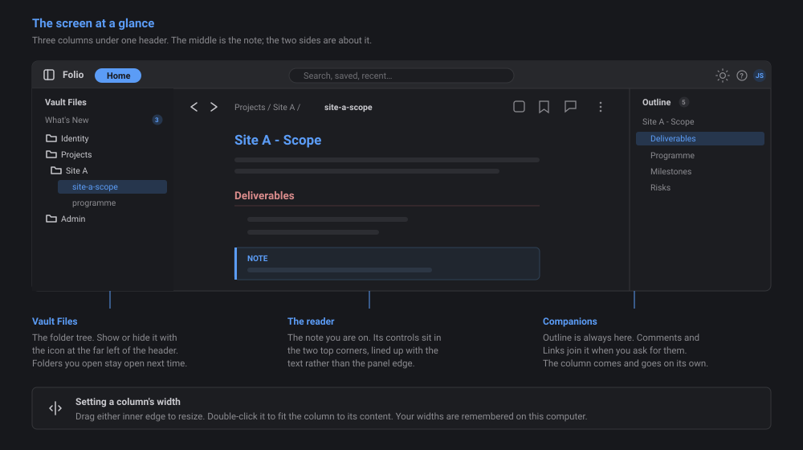
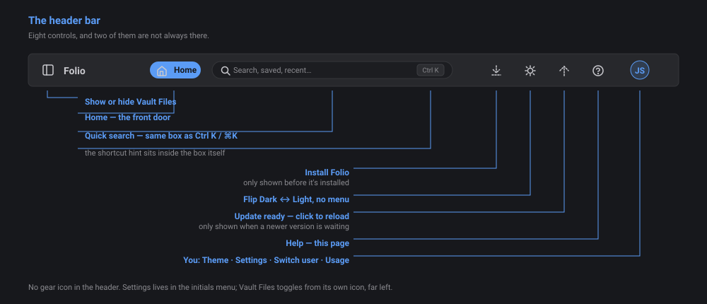
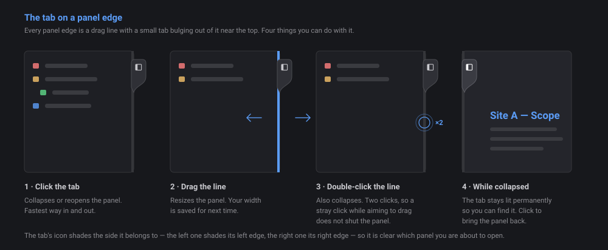
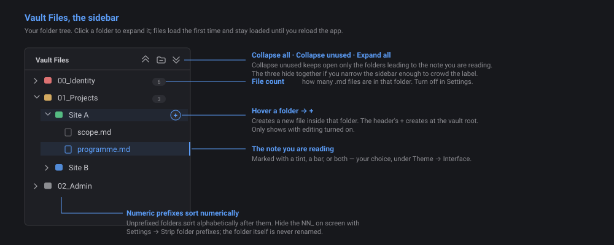
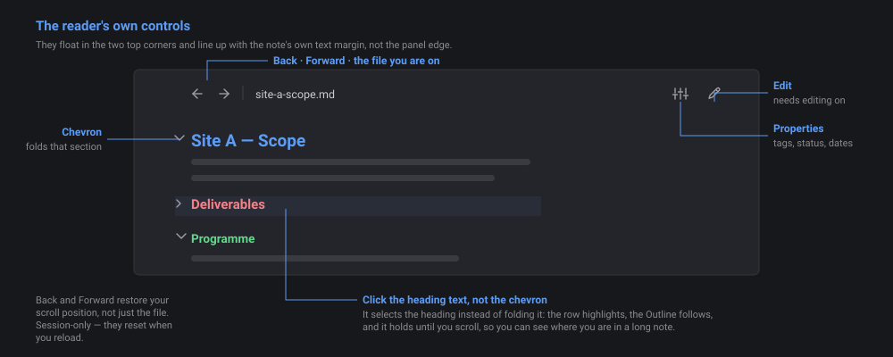
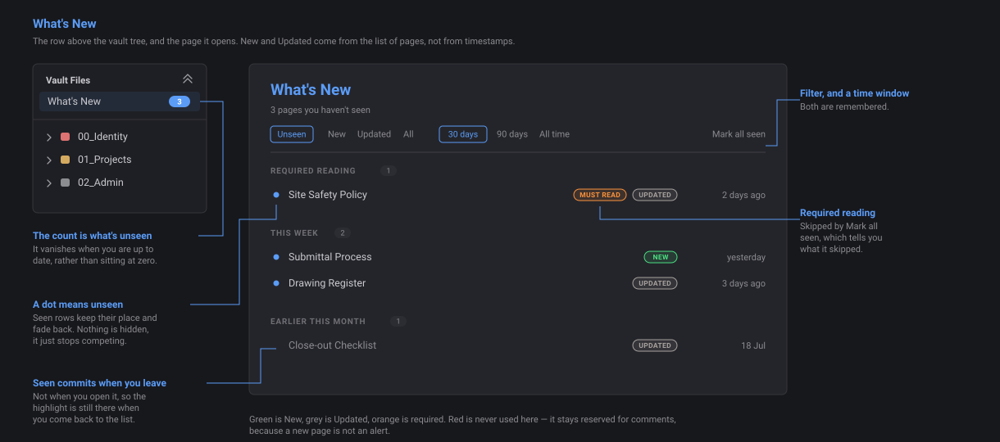
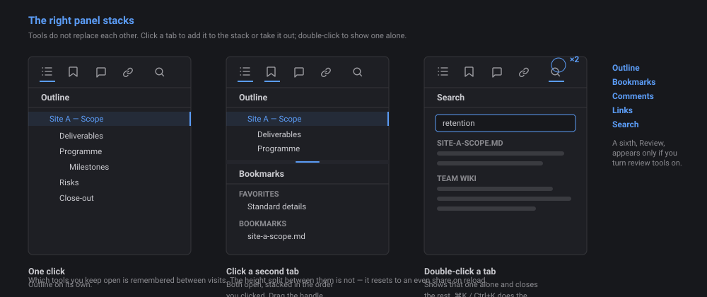
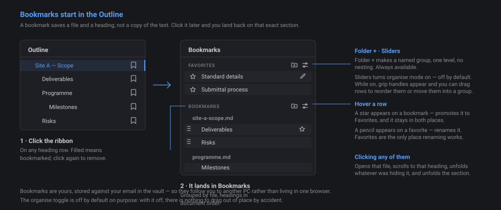
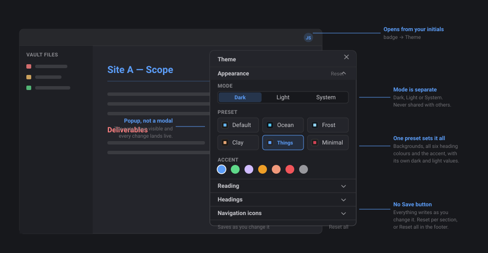

# WikiBase Help

> [!NOTE] About this page
> This page lives with the app, not inside your vault, so it never appears in the navigation tree. Press the **?** icon in the header to come back here at any time. Written for **Version 0.32.0**.

**This page covers using the wiki** — finding your way around, reading, searching, bookmarking, and making it look the way you want.

**Writing and editing notes is a separate page: [Help — Editing and Markdown](help-edit.md).** Go there for turning on editing, creating and moving files, the editor, properties, review, and the full Markdown reference.

New here? Read [[#1. Start here]] and [[#2. Getting around]], then stop. That is enough to use the wiki.

---

## Contents

1. [[#1. Start here]] — what this is, installing it, your first launch
2. [[#2. Getting around]] — the header, the panels, Vault Files, moving between notes
3. [[#3. Reading a note]] — folding, links, images, tables, checkboxes
4. [[#4. Finding things]] — What's New, Outline, Search, Bookmarks, Links
5. [[#5. Making it yours]] — the Theme panel and Settings
6. [[#6. Comments]] — leaving and answering comments
7. [[#7. Quick reference]] — shortcuts and where every control lives
8. [[#8. Troubleshooting]] — when something is not working

---

## 1. Start here

### What WikiBase is

WikiBase reads a folder of Markdown notes and presents it as a team wiki. It is a reader first: you can browse, search and comment without ever changing a file. Editing is off until you turn it on.

The notes are ordinary `.md` files in a OneDrive-synced folder. Obsidian and WikiBase are two windows onto the same files — edit a note in Obsidian and it is there in WikiBase on the next load, and the reverse. Nothing is locked into this app.

### Installing it

WikiBase is a web app at a link, not a file to copy around. Installing it as an app rather than bookmarking the page matters: that is what lets your browser remember your vault folder permanently instead of asking every launch.

**One-time setup:**

1. Open the WikiBase link in **Chrome or Edge**. Safari does not support the folder access this needs.
2. Install it: address bar → the install icon (a small monitor with an arrow), or **⋯ menu → Apps → Install this site as an app**.
3. Click **Open vault folder…** and pick your local OneDrive-synced copy of the vault. Pick the folder that *directly* contains your notes and note folders, not a parent of it.
4. When the browser asks **Allow this time / Allow on every visit / Don't allow**, choose **Allow on every visit**. This is the step that stops it asking again.

**Daily use:** open it from wherever you installed it, Start menu, taskbar or desktop. It should load straight to your vault with no prompt.

**Teams tab:** your team lead can add WikiBase to a channel via **+ Add a tab → Website**, pasting the same link.

### Your first launch

The first time you open WikiBase it asks for your **name and email**. This is not a login and there is no password. The wiki inherits whatever access you already have to the folder. The name is what appears on comments you post; the email is the key your bookmarks and favorites are filed under.

Your profile is stored in the vault itself, so typing the same email on a different PC brings your saved name and bookmarks back. You will see a "Recognized" note and one more click to confirm.

To change it later: **your initials badge, top right → Switch user**.

### The screen at a glance

Three columns. The **reader** in the middle is the note you are on. Either side of it is a **panel** holding tools, and both panels work the same way: a row of tool icons across the top, and whichever tools you have open stacked below.

Out of the box the left panel holds the tools for getting somewhere — **Vault Files**, **Search**, **Bookmarks** — and the right holds the tools about what you are reading — **Outline**, **Comments**, **Links**, and **Review** if you have it. You can move any tool to either side. Either panel collapses out of the way.

---

## 2. Getting around

### The header bar

| Icon | What it does |
|---|---|
| **+** | New file or folder at the vault root. Needs editing on, see [Help — Editing and Markdown](help-edit.md) |
| **⇄** | Move a file to another folder. Same gate |
| *WikiBase — vault name* | Just a label |
| **☀ / ☾** | Flip Dark ↔ Light straight away, no menu |
| **↑** | Only appears when a newer version of the app is ready. Click to reload into it |
| **?** | This help page |
| **Your initials** | Account menu: **Theme**, **Settings**, **Switch user** |

There is no gear icon and no panel-toggle buttons in the header. Settings moved into the initials menu, and the panel toggles moved onto the panel edges themselves.

### Opening and closing panels

Between each panel is a thin vertical line with a small tab bulging out of it near the top.

- **Click the tab** — collapse or reopen that panel. This is the fastest way.
- **Drag the line** — resize. Widths save and come back on your next visit.
- **Double-click the line** — collapse. Two clicks, not one, so an accidental click while aiming for a drag does not shut the panel on you.
- **Drag narrow and let go** — snaps shut.

When a panel is collapsed its tab stays permanently lit so you can find it. Click it to bring the panel back.

> [!TIP]
> The tab's icon shades the side it belongs to. The left one shades its left edge, the right one shades its right edge, so it is clear which panel you are about to open.

**If a panel stops widening**, it has hit the reader's floor. The reader keeps a minimum width that scales with your screen — 1200px on a 1920-wide monitor, 900px from 1440, 600px below that — and the side panels stop before they push it under that. Collapse the other panel if you need more room.

### Vault Files

- **Expand a folder** — click the folder row. Files load the first time you open it and stay cached until you reload.
- **Fold control** — one button to the right of the "Vault Files" label. It collapses the whole tree, and the same button expands it again once everything is closed. It hides if you narrow the panel enough to crowd the label.
- **Vault Files is always available.** It is the one tool that cannot be closed or moved to the other side. You can reorder it against Search and Bookmarks, but it is always somewhere.
- **New and Move** sit at the bottom of whichever panel holds Vault Files, and only appear at Contributor or above.
- **The tree remembers how you left it.** Folders you open stay open across reloads and between sessions, on your own machine. This is the one fold in WikiBase that is saved — notes, outlines and callouts all open fresh every time. A closed folder is obviously a closed folder, so remembering it can never mislead you the way a silently collapsed heading could.
- **Sort order** — folders with a numeric prefix (`00_Identity`, `01_Projects`) sort numerically. Unprefixed folders sort alphabetically after them.
- **File counts** — the badge on each folder is how many `.md` files it holds. Turn it off in Settings.
- **Strip folder prefixes** — hides the `NN_` from folder names on screen without touching the actual folder. Settings, off by default.

**What the tree never shows:** anything ending `.comments.md` or `.changes.md`, anything starting with `.`, the `zSystem` folder (comments, change logs, profiles, shared theme), your Obsidian attachments subfolder, the `/config/`, `/themes/` and `/assets/` folders, and this help page.

### Moving between notes

The reader's own top-left corner holds **Back**, **Forward** and the name of the note you are on. Back and Forward work like browser tabs and restore your scroll position, not just the file. The history is session-only and resets when you reload.

**Open last note** (Settings → Navigation, on by default) reopens the note you were last reading when you launch, expanding whatever folders are needed to reach it **on top of** the tree you left open. The two work together: your saved tree is the starting point, the path to the note is added to it. Turn it off and you simply get your tree back without a note opening.

---

## 3. Reading a note

### Folding headings

Every heading H1 through H6 folds. Click the **chevron** to the left of a heading to fold or unfold its section; child headings fold with their parent. **Alt-click** the chevron (Option on a Mac) to fold or unfold the entire subtree beneath it in one go.

**A note always opens fully expanded.** Nothing you fold is remembered between visits. This is deliberate: folds used to be saved per note, which meant a note could open collapsed weeks later because of a Collapse All somebody ran once, with nothing on screen to say anything was missing.

When something *is* folded, the row says so — a small **"N hidden"** badge appears next to it, counting the headings and list items tucked underneath. You should never have to wonder whether a note is short or just closed.

**Clicking the heading text**, rather than the chevron, selects that heading: the row highlights and the Outline moves its marker to match, holding there until you scroll.

**Collapse all and Expand all are in the Outline panel**, not the reader — see [[#Outline]] below. The reader folds one heading at a time.

### Folding lists

Nested lists get their own chevrons. Click one to fold that item's children, or **Alt-click** to fold its whole subtree at any depth — the same modifier as headings.

**Hover anywhere over a list** and a small **All** control appears at the end of its first row, folding or unfolding that entire list. It does nothing Alt-click cannot; it is there so you can find it. Lists with no nesting have nothing to collapse and get no control.

Unlike headings, **list folds are remembered per note.** The asymmetry is on purpose: headings are scaffolding you did not write, lists are content the author shaped, and a long checklist you collapsed is usually meant to stay collapsed. The "N hidden" badge is what makes that safe — a bullet that reopens reading "12 hidden" tells you exactly what it is holding.

### Folding callouts

Every callout with a body has a **chevron** at the right of its coloured title row. Click it to fold the body away. The title row keeps its colour, icon and title, so a folded warning still reads as a warning.

If you write callouts in Obsidian, its `-` and `+` suffixes work here: `> [!warning]-` opens collapsed, `> [!warning]+` opens expanded. Unlike Obsidian, you do not *need* a suffix — every callout folds here regardless. Nothing is written back to the file and nothing is remembered; the file decides how a callout opens, every time.

### Links between notes

| You write | It does |
|---|---|
| `[[Note Name]]` | Opens that note |
| `[[Note Name\|Display text]]` | Same, with your own wording |
| `[[Note Name#Heading]]` | Opens that note and scrolls to the heading |
| `[[#Heading]]` | Scrolls within the note you are already reading |
| `[text](https://example.com)` | Opens in a new tab |

Links resolve against every file loaded so far. A link to a note in a folder you have not expanded yet shows **muted and dashed** — expand that folder and it lights up. Jumping to a heading unfolds whatever was hiding it and gives it a brief highlight so you can see where you landed.

Writing links is covered in [Help — Editing and Markdown](help-edit.md).

### Folder and file-share links

A link to a network folder or drive path (`file://` UNC, or `X:\...`) cannot open Explorer from a web page. No browser allows it. Clicking one **copies the cleaned path to your clipboard** instead, with a brief confirmation, ready to paste into Explorer's address bar.

### Images

Each note's images live in a subfolder next to it, named "Attachments" by default here, following Obsidian's **"in subfolder under current folder"** setting. That subfolder is hidden from the tree automatically.

### Tables, and widening a column

Tables render as written. Obsidian sizes each column to its widest cell, so the usual way to force a narrow column wider there is to add a row of periods under the header.

WikiBase understands that row. **A row made entirely of periods is hidden in the reader, but still sets the column widths** — you get the layout you set up in Obsidian without the dots showing. A cell needs **five or more periods and nothing else** to count as padding.

If any cell in the row has real text in it, the whole row is treated as content and shows normally. So a cell reading `Waiting.....` is safe.

### Tags

`#tag` renders as a coloured chip, `#parent/child` for a nested one. Tags follow your accent colour. They are display-only for now, no click-to-filter.

### Ticking task checkboxes

`- [ ]` and `- [x]` items are clickable straight from the reader, with no need to open the editor. This needs editing turned on. Ticking a box writes to the file quietly: no change-log entry, no "Needs Review" flag.

---

## 4. Finding things

### What's New

The row above the vault tree, with a count of pages you have not seen yet. Click it for a page listing everything that has changed, newest first. The count disappears when you are up to date rather than sitting at zero.

- **New vs Updated** — New means the page did not exist last time WikiBase looked. Updated means it did and its contents have changed since. New is worked out from the list of pages rather than from dates, so a page still reads as New even after its properties get filled in. Updated is worked out by comparing the page's actual text, so OneDrive touching a file without changing anything in it does not count as an edit.
- **An updated page lists the sections that changed.** The headings appear under the file name. Click one and the page opens at that heading with it highlighted, the same as clicking an Outline entry. The highlight stays until you scroll. If several separate edits land before you get to the page, all of them are listed.
- **Clicking a heading clears that heading only.** The others stay waiting. The file itself is not marked seen until the last one is done, so the count still tells you there is reading left. Opening the file name instead of a heading answers all of them at once, because you opened the page.
- **A heading you have already read stays in the list**, greyed out, and stays clickable. That is how you get back to it if you clicked the wrong one. If it gets edited again later it goes back to unread, because clearing it answered the edit you read, not every edit it will ever get.
- **A page with no sections listed** was changed somewhere outside a heading, or only in its properties.
- **The date on the right is colour-coded by age** — green within the last week, amber up to a month, grey after that. It is only ever a second way of saying what the date and the group heading already say, so nothing is hidden if the colours are hard for you to tell apart.
- **Seen happens when you leave a page, not when you open it.** Open something from the list, read it, come back, and it is marked seen. That way the highlight is still there when you return, instead of clearing the instant you click.
- **The first time you ever open WikiBase, everything counts as seen.** You start from today rather than from a list of every page anyone has ever written.
- **Filters** — Unseen, New, Updated or All, and a separate 30 days / 90 days / All time window. Both are remembered, and every one of them shows the changed headings under a file, not just Unseen.
- **Mark all seen** clears the list, and **skips anything marked as required reading**, telling you what it skipped. Required pages can only be cleared by actually opening them.
- **Renaming or moving a page in Obsidian does not resurface it** for the whole team — it is matched by its contents, so it keeps whatever seen state it already had. Deleting one removes it from the list.
- **If hundreds of pages change at once** — usually OneDrive rewriting timestamps rather than anyone editing — the list says so in one line instead of flooding.

**Required reading and onboarding.** Two optional properties an author can put on a note:

| Property | What it does |
|---|---|
| `must-read: true` | Puts the page in a **Required reading** group with an orange pill, and keeps it out of Mark all seen. Fades from required after 30 days, counted from the first time *you* saw it, so time off doesn't cost you the notice. It stays in your list as unseen until you open it. |
| `onboarding: true` | Marks the page as one a new starter should read. Never expires. |

Set them the same way as any other property, in the Properties panel or in Obsidian. See [Help — Editing and Markdown](help-edit.md).

**Where this is stored:** on your own machine, like your theme and your open folders. Nothing about what you have read is written into the vault, and nobody else can see it.

### The panels

Both panels behave identically. Tools **stack** rather than replace each other.

- **Click a tool icon** — add that tool to the stack, or take it out.
- **Double-click a tool icon** — show that one alone, closing the rest of that panel.
- **Drag the handle between two open tools** — change how the height is split.
- **Drag a tool's title bar** — move it up or down the stack, or across to the other panel.
- **Move button in a tool's title bar** — send it to the other panel in one click.

Which tools are in which panel, the order they are stacked in, and the height you gave each one are all remembered.

### Resizing a panel

The thin line between a panel and the reader does three things.

- **Drag it** — resize the panel. Dragging never collapses it, however slowly you drag.
- **Click the tab that appears on it** — collapse the panel, or open it again. The tab stays visible while a panel is collapsed, so there is always a way back.
- **Double-click the line** — widen the panel to fit its longest visible row. Useful when a file name is being cut off. It fits what is on screen, not what is inside folders you have not opened.

### Outline

Every heading H1 through H6 in the current note, indented by level. Click one to scroll to it; the active heading highlights as you scroll.

The badge next to the label counts the headings in the note, the same way the badge on a folder row counts its files.

Each outline row with headings under it has its own chevron; **Alt-click** one to take its whole subtree. The **single button** on the right of the toolbar collapses the whole outline, and the same button expands it again once everything is folded.

**The Outline and the reader fold independently.** Collapsing the outline gives you a quick map of a long note without collapsing the note you are reading, and folding a heading in the reader leaves the outline intact. This is how Word's Navigation Pane, Obsidian's Outline and VS Code's Outline view all behave — an outline is a view of the document, so folding it is a view operation.

Neither the outline's folds nor the reader's survive a reload.

### Search

Press **⌘K** (Mac) or **Ctrl+K** (Windows) anywhere to open Search with the field focused.

Results come in two labelled groups: **this file first, then the whole vault**, with filename matches ahead of content matches. Each result shows a snippet; clicking one scrolls to it and highlights it. **Esc** clears the field, and a second **Esc** closes the tab. Arrow keys move through results, Enter opens.

The index is built once per session and refreshed whenever a file is written, so it will not go stale mid-session.

### Bookmarks and Favorites

**To bookmark something:** open the Outline and click the **ribbon icon** on any heading row. That saves the file *and* that heading, not a copy of the text. Click it again to remove it.

The **Bookmarks tab** has two sections:

- **Bookmarks** — grouped by file. Headings sit in document order; you reorder the files themselves.
- **Favorites** — a flat, hand-ordered shortlist, empty until you add to it.

**Promote to Favorites** — hover a bookmark row and click the star. It stays in both places.

**Rename a favorite** — hover it and click the pencil. Favorites are the only place renaming is possible.

**Clicking any bookmark** opens that file, scrolls to that heading, unfolds anything hiding it, and unfolds the section itself. If the Outline is also open, it follows along.

**Organising them** — each section header has two icons:

| Icon | What it does |
|---|---|
| **Folder +** | Create a named group. One level only, no groups inside groups. Always available. |
| **Sliders** | Turn organise mode on. Off by default. While on, grip handles appear and you can drag rows to reorder them or move them in and out of groups. |

Organise mode is off by default on purpose: with it off there is nothing to drag by accident.

Bookmarks are **yours**, stored against your email in the vault, so they follow you to another PC rather than living in one browser.

### Links

Two lists for the open note:

- **Outgoing** — everything this note links to, bucketed into MD Files, Websites, Folders and Other. Read live from the note, always complete.
- **Backlinks** — notes that link *to* this one. Only files opened this session are scanned, so this list grows as you browse. It is not a vault-wide index and is not meant to be one.

### Usage

**Administrator only.** A report on the vault, in three lists:

- **Most read** — which pages the team actually opens. Usually not the pages you expected when you built the wiki.
- **Never opened** — pages nobody has ever read. The most useful list here: either the page is dead and can go, or it is needed and nobody can find it.
- **Gone quiet** — a page that used to get traffic and stopped for a month or more. Nearly always a page that went out of date and people gave up on.

Each list shows the top five with a **Show more** for up to twenty-five. Click any row to open that page.

**This reports on files, not on people.** No names, no per-person counts, no way to see who read what. The report cannot show that, because the totals it reads have already had the names dropped out of them.

**What is recorded, and when.** WikiBase notes which page you are on once it has loaded, and how long you stayed. Nothing is written while you read. When you switch away from the tab or close it, that sitting is written to a hidden file in the vault under `zSystem/Analytics/`, one file per person per month, one line per page per day. That file is safe to delete at any time; it will simply start again.

Because the write happens when you leave, your own reading appears quickly and other people's lags by up to one sitting, plus however long OneDrive takes to sync. It is near-live, not live.

---

## 5. Making it yours

Two separate places. **Theme** is how the wiki looks; **Settings** is how it behaves. Both live under your initials badge, top right.

### Theme panel

Open with **initials badge → Theme**. It is a popup, not a modal, so the note stays visible behind it and every change lands live as you make it. There is no Save button — everything writes the moment you change it. Each section has its own **Reset**, and there is a **Reset all** in the footer. One section opens at a time.

#### Appearance

| Control | Options | Default |
|---|---|---|
| Mode | Dark / Light / System | Dark |
| Preset | Default, Ocean, Frost, Clay, Mica, Marble, Things, Minimal | Things |
| Accent | The preset's own accent plus six alternates, tuned per mode | The preset's own |

A preset sets backgrounds, all six heading colours and the accent together, with separate dark and light definitions. **System** follows your computer's own dark/light setting. The accent drives buttons, links, the active row and tag chips.

#### Reading

| Control | Options | Default |
|---|---|---|
| Width | Narrow / Normal / Wide | Normal |
| Text size | Small / Medium / Large | Medium |
| Line spacing | Tight / Normal / Relaxed | Normal |
| Body font | System sans / Serif / Monospace | System sans |

#### Headings

- A **colour** for each level H1 through H6, plus an **underline** and a **capitals** toggle per level. Underline ships on for H2 only, capitals on for H5 only, which is how it looked before these controls existed.
- **Heading scale** — Compact / Normal / Large. One control instead of six size fields.
- **Inline title** — off by default. Turns on a large heading of the note's own name at the top of the document, Obsidian-style. The reader header shows the filename either way.

Changing any heading colour flips the badge to **Custom** and seeds all six from your current preset. Custom colours are held separately for dark and light, since a colour that reads on near-black often fails on white; there is a one-click **Copy these to the other mode** for when you want them to match. Picking a named preset again clears the override.

#### Navigation icons

| Control | Options | Default |
|---|---|---|
| Icon style | Folder and file / Chevron / Dot / None | Folder and file |
| Folder colour | Rainbow by position / Accent / Single colour / Muted | Rainbow by position |
| Colour file icons too | On / Off | Off |

Rainbow by position means folders cycle through a colour set based on where they sit in the tree. Choosing **Single colour** reveals a six-swatch picker holding the same hues the rainbow cycles through. File icons stay quiet next to coloured folders unless you turn the third control on.

#### Interface

| Control | What it does |
|---|---|
| Chrome tone | **Contrast** gives the panels, header and reader their own shades. **Match reader** flattens the panels and header into the reader surface. **Flat** puts everything on one surface. Default Contrast. |
| Borders | None, **Hairline** (default) or Strong. |
| Active row | How the open file is marked: a **Bar** on the edge, a **Tint** behind the row, or **Both** (default). |
| Density | **Compact**, Normal (default) or Roomy row spacing in Vault Files and Outline. |

> [!NOTE] Borders → None
> This clears the decorative dividing lines only. Toggle tracks, resize handles and input outlines keep their outline on purpose — without it they vanish rather than look minimal.

#### Share

Set your look up once and pass it to the rest of the team.

**Copy** puts your theme into the box as a `WBTHEME1:` string. Send it to someone; they paste it into the same box and click **Apply pasted**.

**Set as vault default** saves it to the vault itself, at `zSystem/theme.json`. Anyone opening WikiBase for the first time starts with that look instead of the plain default. It never overwrites a theme someone has already chosen — if you have used WikiBase before, your own settings stay exactly as they are.

Dark vs light is **not** included in a shared theme. That stays personal, and it can be set to System, so sharing a look never forces anyone else's screen to your preference.

#### Elsewhere

**Callouts** — all 13 Obsidian callout types render in theme-matched colours, grouped the way Obsidian groups them: note, info and todo share blue; failure, danger and bug share red, and so on. These follow the mode rather than the preset. There's also a 14th type WikiBase adds itself, `[!copy]`, which carries a **Copy** button that puts its text on your clipboard as plain text — see [Editing and Markdown](help-edit.md) for how to write one.

### Settings

Open with **initials badge → Settings**.

| Setting | Default | What it does |
|---|---|---|
| Open last note | On | Reopens the note you were reading, expanding the folders to reach it |
| Strip folder prefixes | Off | Hides the `NN_` prefix from folder names on screen |
| Show file counts | On | The file-count badge on each folder |

**Advanced Settings**, collapsed by default, holds one thing: **Access**.

### Access tiers

WikiBase has three levels, each one including everything below it. You pick yours from the dropdown in Advanced Settings.

| Tier | What it adds |
|---|---|
| **User** | The default. Read, search, outline, bookmarks, comments, What's New, themes. Nothing in the vault changes. |
| **Contributor** | New, Move, Edit, the Properties fields, clickable task checkboxes, the Review tab, the bell and both inboxes. |
| **Administrator** | Changing the two tier passwords. |

**Moving up asks for that tier's password. Moving down never does**, so nobody is stuck in a mode they turned on by accident. Your tier is remembered on **this PC** and does not follow you to another machine.

Anything your tier does not include is not shown at all, rather than shown greyed out.

Editing and reviewing are both Contributor, deliberately. Only an edit made in the app writes the change record that the Review tab exists to show, so a reviewer who cannot edit would be looking at an empty list.

### Setting the passwords the first time

A new vault has no passwords, and until an Administrator password exists **every tier is open to anyone**. That is the same as the old on/off switches, and Settings says so plainly while it is the case.

To turn the gate on: switch to **Administrator** (you will not be asked for anything), then set both passwords together. Setting only one leaves a door open, because anyone can pick Administrator and change the other.

Afterwards, an Administrator can change either password from the same place.

**What this is and is not.** This is an interface gate, not security. The passwords are stored as one-way hashes in your vault at `zSystem/auth.json`, never in the app, which is why an app update never wipes them. But the check runs in your browser and someone determined can get around it, and anyone who can reach the vault can edit any note in Obsidian no matter what tier they picked in WikiBase. Treat tiers as a way to keep people out of controls they do not need, not as a lock.

Both tiers above User are covered in [Help — Editing and Markdown](help-edit.md).

### Forgetting a password

There is no reset button, and that is deliberate: a reset you could reach from this screen without the password would be a second door with no lock on it. The way back is the vault itself.

1. Open the vault in Obsidian, or in SharePoint in a browser.
2. Delete `zSystem/auth.json`.
3. Switch back to WikiBase. Every tier opens again with no prompt, exactly like a vault that was never set up.
4. Go to **Settings → Access**, switch to **Administrator**, and set both passwords again.

You do not need to reload WikiBase. It re-reads that file whenever you come back to the tab, so tabbing out to delete it and tabbing back is all it takes.

**Nobody can be permanently locked out.** Anyone who could lose a password already has the vault access needed to undo it — the file lives in the same SharePoint folder as the notes. If that is not the answer you want, the thing to change is who can write to the vault, not the passwords.

The same three steps fix a hand-edited `auth.json` that has stopped making sense: a malformed file reads as "not set up", which is an open gate rather than a lockout.

### Where your preferences live

Theme, settings, panel widths and fold state save to **this browser's local storage on this PC**. Your bookmarks, favorites, name and email are different — those live in the vault under your email, so they follow you to another machine.

Clearing browser data or reimaging a PC resets the first group to defaults, or to the vault default if one has been set. It does not touch the second.

---

## 6. Comments

Commenting never requires editing to be on. Anyone can comment.

Open the **Comments** tab in the right panel. It shows the comments on the note you are reading, with a post box underneath.

**To post:** pick a type, write, click **Post**.

**To close one:** click **Mark closed**. Closed comments dim rather than disappear.

**Clicking a comment** selects it and tries to find the text it refers to in the note, so you can see what it is about without hunting.

**The whole vault at once:** at the bottom of the Comments tool there is an **All comments** button. That scans every folder and lists every open comment across the vault in the reader, so nothing sits unanswered in a folder nobody opened. The number on the Comments icon is that same vault-wide count of open comments. The Review tool has the same thing, **All changes**.

The rule is the same for both: the **tool** shows the note you are reading, the **button at the bottom of it** shows the whole vault.

| Type | Use for |
|---|---|
| 📝 Note | Observations or context |
| ❓ Question | Something that needs an answer |
| ✅ Action | Something that needs doing |
| 🚩 Flag | Something that needs attention |

Comments are written to a sidecar `.comments.md` file that OneDrive carries to the rest of the team. They are stored as HTML comment blocks, which means they are **invisible if you open that note in Obsidian** — they never clutter the note itself.

**Email digests:** if your vault lives in a SharePoint or Teams document library, SharePoint can email you when comments change. Open the vault folder in SharePoint in a browser, hover it → three-dot menu → **Alert me** → **All changes** → **Send a daily summary**. One email a day covering the whole vault. Set the alert on an individual `.comments.md` file instead if you only care about one note.

---

## 7. Quick reference

### Keyboard shortcuts

| Keys | Does |
|---|---|
| `⌘K` / `Ctrl+K` | Open Search and focus the field |
| `Esc` in search | Clear the field; again to close the tab |
| `↑` `↓` in search | Move through results |
| `Enter` in search | Open the highlighted result |
| `Esc` | Close the Theme panel |

### Where every control lives

| Looking for | It is at |
|---|---|
| Settings | Initials badge, top right → Settings |
| Theme, colours, fonts, density | Initials badge → Theme |
| Dark / Light | Sun-moon icon in the header |
| Change your name or email | Initials badge → Switch user |
| Point the app at a different folder | Initials badge → Reconnect to vault |
| What changed since you last looked | **What's New**, above the vault tree |
| Open or close a side panel | Click the tab on that panel's drag line |
| Resize a panel | Drag the line; double-click it to collapse |
| Collapse folders | One button above the vault tree |
| Collapse headings | One button in the Outline panel |
| Fold a whole subtree | Alt-click the chevron (Option on Mac) |
| Fold a whole list | Hover the list, click **All** on its first row |
| Fold a callout | Chevron at the right of its title row |
| Back and Forward | Reader's top left, beside the filename |
| Edit a note | Pencil, reader top right. Needs editing on |
| Note properties | Sliders icon, next to the pencil |
| Bookmark a heading | Ribbon icon on that heading's Outline row |
| Search | `⌘K` / `Ctrl+K`, or the magnifier tab |
| Which pages get read, and which never do | **Usage** tool. Administrator only |
| Version and changelog | The version button at the bottom of the right panel |
| How to write Markdown | [Help — Editing and Markdown](help-edit.md) |

---

## 8. Troubleshooting

**"Reconnect to vault" appears instead of loading straight in**
The browser's permission to your vault folder was reset. A Chrome or Edge update, or clearing site data, does it. Click the button and choose **Allow on every visit** again. Nothing is wrong with your notes.

**"Could not load vault"**
The folder WikiBase remembers has been moved, renamed or unsynced from OneDrive. Click **Open a different folder…** and re-pick it.

**You picked the wrong folder and it keeps loading that one**
WikiBase remembers your choice and reuses it every launch, so this does not clear itself. Initials badge → **Reconnect to vault**, then pick the right folder. Cancelling the picker changes nothing, so a misclick costs you nothing.

**The vault opens but shows no files**
You have probably picked a parent folder. Re-pick the folder that directly contains your notes and note folders.

**A link shows muted and dashed**
Its target is in a folder you have not expanded yet. Open that folder in Vault Files and the link activates.

**Images are not loading**
The image must be in the attachments subfolder beside the note that references it, with the filename matching exactly, including case. If *every* image in the whole vault is broken, the attachments subfolder name configured in the app does not match what Obsidian actually created — flag it to whoever manages WikiBase.

**New, Move or Edit will not work**
You are on the **User** tier. Switch to **Contributor** in **Settings → Advanced Settings → Access**. You will be asked for the Contributor password, unless nobody has set one yet. See [Help — Editing and Markdown](help-edit.md).

**A panel width or fold state did not come back**
Those save to this browser's local storage. Clearing browser data or using a private window resets them. Your bookmarks and profile are unaffected, they live in the vault.

**A note looks different here than in Obsidian**
Most likely raw HTML, a Mermaid diagram or MathJax. See [Help — Editing and Markdown](help-edit.md) for what WikiBase deliberately does not render.

**Someone else's changes are not showing**
The vault syncs through OneDrive, so there is a lag between their save and your copy. Check OneDrive has finished syncing, then come back to the tab — WikiBase re-reads the vault whenever it regains focus, so you should not need to reload.

**What's New is not picking up an edit**
Switch to another window and back. That is when WikiBase re-reads the vault. If it still does not appear, OneDrive has not finished syncing the file to your machine yet.

**Nobody knows the Administrator password**
Nobody is locked out. See [Forgetting a password](#Forgetting a password) — you delete one file in the vault and set them again.

**I think I am on an old version**
When a newer version is ready, an **up arrow** appears in the header. Click it to reload into it. Installed apps do not always pick up new versions on their own, which is what that arrow is for.
